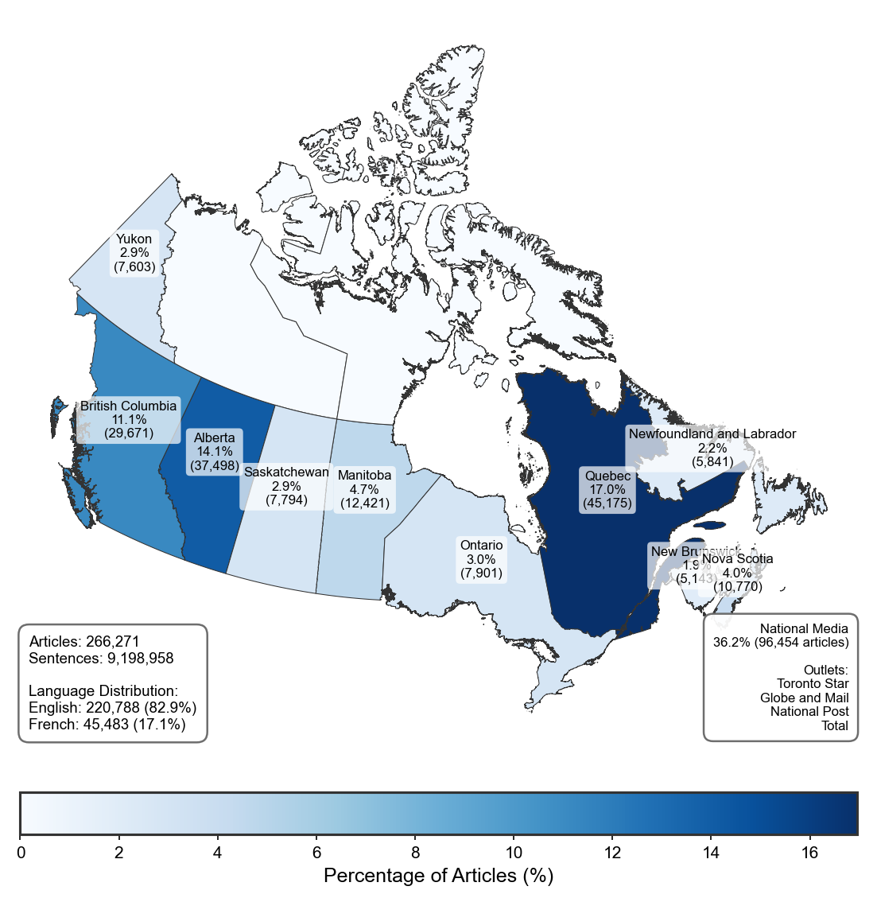

# CCF-canadian-climate-framing

<p align="center">
   
</p>

# [Have a look at our website here!](https://ccf-project.ca/Home)

## Technical paper

### **[Read the full technical paper here](https://github.com/antoinelemor/CCF-canadian-climate-framing/blob/main/paper/CCF_Methodology/Latex/CCF_Methodology.pdf)**

[](https://github.com/antoinelemor/CCF-canadian-climate-framing/blob/main/paper/CCF_Methodology/Latex/CCF_Methodology.pdf)
[](https://github.com/antoinelemor/CCF-canadian-climate-framing/raw/main/paper/CCF_Methodology/Latex/CCF_Methodology.pdf)
[](paper/CCF_Methodology/Latex/CCF_Methodology.pdf)
[](paper/CCF_Methodology/Latex/CCF_Methodology.pdf)

The technical paper provides documentation of:
- **Complete annotation framework** with 65 hierarchical categories
- **Machine learning methodology** including model selection, training, and validation
- **Performance metrics** for all categories (macro F1 = 0.866)
- **Database architecture** and PostgreSQL implementation
- **Detailed validation protocols** and inter-coder reliability assessments

## Introduction

Welcome to the **CCF-canadian-climate-framing** repository. This project is dedicated to studying media coverage of climate change in the Canadian press through the most comprehensive machine-learning-preprocessed corpus of climate discourse available for research. The **[CCF Database](https://github.com/antoinelemor/CCF-canadian-climate-framing/blob/main/paper/CCF_Methodology/Latex/CCF_Methodology.pdf)** comprises 266,271 articles from 20 Canadian newspapers (1978–2025) processed into 9.2 million sentence-level analytical units with 65 hierarchical annotations, achieving a macro F1 score of 0.866 across all categories. This is the first initiative of this scale in Canada known to the authors.

This work focuses on identifying and extracting a multitude of information by annotating the full texts of articles at the sentence level in order to analyze their complete content in the most detailed way, over time and across different Canadian regions and media outlets. We annotate [more than 60 categories](#what-do-we-annotate-and-extract-from-texts-) including eight thematic frames (economic, health, security, justice, political, scientific, environmental, cultural), actor networks, climate events, policy responses, emotional tone, and geographic focus. The database structure, implemented in PostgreSQL with indexed boolean columns, supports complex queries combining temporal, linguistic, geographic, and thematic dimensions. This repository contains all the scripts, data processing tools, and machine learning models necessary for conducting this study.

### The database

This repository includes a newly compiled database of climate change articles from 20 major Canadian newspapers (n=266,271) (_not available in plain text at this time for copyright reasons_). The table below shows the distribution of articles per newspaper (_after filtering and preprocessing_), and the figure the distribution of articles through time.

| Toronto Star | Globe and Mail | National Post | Calgary Herald | Edmonton Journal | Vancouver Sun | Le Devoir | Winnipeg Free Press | Times Colonist | Chronicle Herald | Montreal Gazette | La Presse Plus | Star Phoenix | Whitehorse Daily Star | La Presse | The Telegram | Journal de Montreal | Acadie Nouvelle | Le Droit | Toronto Sun | **Total** |
|--------------|----------------|---------------|----------------|------------------|---------------|-----------|---------------------|----------------|------------------|------------------|----------------|--------------|----------------------|-----------|--------------|---------------------|-----------------|----------|-------------|-----------|
| 46,980 | 29,442 | 20,032 | 19,336 | 18,162 | 17,871 | 13,685 | 12,421 | 11,800 | 10,770 | 9,567 | 9,548 | 7,794 | 7,603 | 6,917 | 5,841 | 5,458 | 5,143 | 4,727 | 3,174 | **266,271** |



---

## Table of contents

- [Introduction](#introduction)
- [Members of the project](#members-of-the-project)
- [Project objectives](#project-objectives)
- [Methodology](#methodology)
- [What do we annotate and extract from texts?](#what-do-we-annotate-and-extract-from-texts-)
- [Illustrative results and analyses](#illustrative-results-and-analyses)
- [Citation](#citation)
- [Repository structure](#repository-structure)
- [Usage](#usage)
- [Scripts overview](#scripts-overview)
  - [Annotation scripts](#annotation-scripts)
    - [1_Preprocess.py](#1_preprocesspy)
    - [2_JSONL.py](#2_jsonlpy)
    - [3_Manual_annotations.py](#3_manual_annotationspy)
    - [4_JSONL_for_training.py](#4_jsonl_for_trainingpy)
    - [5_populate_SQL_database.py](#5_populate_sql_databasepy)
    - [6_Training_best_models.py](#6_training_best_modelspy)
    - [7_Annotation.py](#7_annotationpy)
    - [8_NER.py](#8_nerpy)
    - [9_JSONL_for_recheck.py](#9_jsonl_for_recheckpy)
    - [10_Annotation_metrics.py](#10_annotation_metricspy)
    - [11_Blind_verification.py](#11_blind_verificationpy)


--- 

## Members of the project

- [**Alizée Pillod**, Université de Montréal](https://pol.umontreal.ca/repertoire-departement/professeurs/professeur/in/in35292/sg/Aliz%C3%A9e%20Pillod/), alizee.pillod@umontreal.ca 
- [**Antoine Lemor**, Université de Sherbrooke](https://antoinelemor.github.io/), antoine.lemor@usherbrooke.ca
- [**Matthew Taylor**, Université de Montréal](https://www.chairedemocratie.com/fr/members/taylor-matthew/), matthew.taylor@umontreal.ca


## The project's main idea and objectives

> **The overarching goal of the project is to establish the first pan-Canadian database—comprehensive across time and space—of media articles on climate change, and to perform an in-depth sentence-level analysis of each article’s content.**

The primary purpose is to understand the determinants of climate change media coverage in Canada, in order to inform future research and, ultimately, enhance communication on this topic.

To carry out this overarching research idea, the project is organized around the following objectives, which are currently underway:

| Objective | Description | Status |
|-----------|-------------|--------|
| **Establish a comprehensive pan-Canadian database of climate change media articles** | Establish a comprehensive and representative database covering the entire country's media landscape with historical coverage across both time and space. | **Completed** |
| **Deploy an advanced sentence-level annotation pipeline** | Deploy an annotation pipeline that combines the precision of manual annotations and the scale of machine learning along with named entity extraction to process and annotate articles at the sentence level. | **Completed** |
| **Implement a rigorous, scientifically robust validation process for machine learning models** | Conduct comprehensive performance evaluations using statistical analyses and manual annotations to verify high classification accuracy and ensure research-grade reliability. | **Completed** |
| **Publish the database and initial analyses** | Release the processed database and preliminary research findings for public use. | *In Progress* |

## Methodology

The research workflow for this project is structured as follows:

1.  **Data acquisition and initial corpus:** the foundational dataset comprises 266,271 articles related to climate change from 20 major Canadian newspapers, covering the period from 1978 to the present. *Due to copyright restrictions, the raw text of these articles is not publicly available in this repository.*

2.  **Preprocessing:** articles are processed using `Scripts/Annotation/1_Preprocess.py` to segment texts and generate analytical units (texts are segmented into two-sentence contexts), which are then used to annotate the articles. This step also involves data cleaning and format standardization.

3.  **Database population:** The processed textual data, along with article metadata, is organized and stored in a local PostgreSQL database named `CCF`. The script `Scripts/Annotation/5_populate_SQL_database.py` manages the creation of the database schema and populates key tables, including `CCF_full_data` (for raw article information) and `CCF_processed_data` (for tokenized and annotated sentences).

4.  **Annotation strategy & model training:**
    *   A manual annotation phase is conducted to create high-quality labeled datasets for more than 60 categories (see below - [What do we annotate and extract from texts?](#what-do-we-annotate-and-extract-from-texts-)) through scripts such as `Scripts/Annotation/2_JSONL.py` (to prepare data for annotation tools), `Scripts/Annotation/3_Manual_annotations.py` (to count and analyze manual annotations), and `Scripts/Annotation/4_JSONL_for_training.py` (to structure data for machine learning) are employed. While the specific annotated datasets are not public due to copyright restrictions, they form the basis for training our machine learning models.
    *   State-of-the-art transformer-based models (including CamemBERT and other BERT variants, managed via refactored libraries like `AugmentedSocialScientist` from [Do et al. (2022)](https://journals.sagepub.com/doi/full/10.1177/00491241221134526)) are trained. The script `Scripts/Annotation/6_Training_best_models.py` is used to train and select the optimal models based on performance metrics from cross-validation.

5.  **Automated corpus annotation:** Once trained and validated, these machine learning models are applied to the entire corpus of 266,271 articles. `Scripts/Annotation/7_Annotation.py` performs this large-scale annotation for more than 60 categories (see below - [What do we annotate and extract from texts?](#what-do-we-annotate-and-extract-from-texts-)).

6.  **Named Entity Recognition (NER):** To further enrich the dataset, Named Entity Recognition is performed using `Scripts/Annotation/8_NER.py`. This script identifies and categorizes mentions of persons (PER), organizations (ORG), and locations (LOC) within the text. This process utilizes a hybrid approach that combines best SOTA models: spaCy for French PER and transformer models like CamemBERT/BERT-base-NER for other entities and English.

7.  **Validation and Quality Control:** The integrity and quality of the annotations are paramount. `Scripts/Annotation/9_JSONL_for_recheck.py` facilitates the creation of targeted subsets of data for manual re-verification, especially for underrepresented or ambiguous categories. Performance metrics, including precision, recall, and F1-scores for each annotated category, are systematically computed using `Scripts/Annotation/10_Annotation_metrics.py` to ensure transparency and the best qualitify of the annotation process.

## What do we annotate and extract from texts ?


> **We annotate at the sentence level 65 categories organized hierarchically (frames, actors, events, solutions, emotions, etc.). See Table B1 in the [methodology paper](paper/CCF_Methodology/Latex/CCF_Methodology.pdf) for complete definitions.**

| # | Category | Code | Description |
|---|----------|------|-------------|
| | **THEMATIC FRAMES** | | |
| | *Economic Frame* | | |
| 1 | Economic Frame (Primary) | `economic_frame` | Climate change framed as an economic issue |
| 2 | Negative impacts on economy | `eco_neg_impact` | Economic losses from climate change |
| 3 | Positive impacts on economy | `eco_pos_impact` | Economic gains from climate change |
| 4 | Economic costs of action | `eco_cost` | Financial burdens of climate policies |
| 5 | Economic benefits of action | `eco_benefit` | Financial gains from climate policies |
| 6 | Economic sector footprint | `eco_footprint` | Carbon footprint of economic/industrial sectors |
| | *Health Frame* | | |
| 7 | Health Frame (Primary) | `health_frame` | Climate change framed as a health issue |
| 8 | Negative health impacts | `health_neg_impact` | Health harms from climate change |
| 9 | Health co-benefits of action | `health_cobenefit` | Health benefits from climate policies |
| | *Security Frame* | | |
| 10 | Security Frame (Primary) | `security_frame` | Climate change framed as a security issue |
| 11 | Climate refugees | `security_refugees` | Displacement due to climate impacts |
| 12 | Resource conflict | `security_conflict` | Conflicts over resources due to climate |
| 13 | Post-disaster military assistance | `security_military` | Military deployment after disasters |
| 14 | Disruption of military operations | `security_disruption` | Climate impacts on military infrastructure |
| | *Justice Frame* | | |
| 15 | Justice Frame (Primary) | `justice_frame` | Climate change framed as a justice/moral issue |
| 16 | Winners and losers | `justice_winners` | Distributional outcomes of climate policy |
| 17 | Differentiated responsibility | `justice_responsibility` | Unequal responsibility for causing climate change |
| 18 | Unequal vulnerability | `justice_vulnerability` | Unequal exposure to climate impacts |
| 19 | Unequal access to action | `justice_access` | Unequal capacity to act on climate |
| 20 | Intergenerational justice | `justice_intergen` | Rights of future generations |
| | *Political Frame* | | |
| 21 | Political Frame (Primary) | `political_frame` | Climate change framed as a political issue |
| 22 | Policy action | `pol_action` | Adoption of climate policies |
| 23 | Political debate | `pol_debate` | Disagreements on climate policies |
| 24 | Political positioning | `pol_position` | Stances of politicians/parties on climate |
| 25 | Public opinion data | `pol_opinion` | Polls/surveys on climate attitudes |
| | *Scientific Frame* | | |
| 26 | Scientific Frame (Primary) | `scientific_frame` | Climate change framed as a scientific issue |
| 27 | Scientific debate | `sci_debate` | Debates within the scientific community |
| 28 | Scientific discovery | `sci_discovery` | Explanations or discoveries in climate science |
| 29 | Questioning of climate science | `sci_skepticism` | Challenges to validity of climate science |
| 30 | Defense of climate science | `sci_defense` | Affirmations of climate science validity |
| | *Environmental Frame* | | |
| 31 | Environmental Frame (Primary) | `environmental_frame` | Climate change framed as an environmental issue |
| 32 | Loss of natural environments | `env_habitat` | Degradation/loss of habitats |
| 33 | Loss of fauna and flora | `env_species` | Impacts on animal and plant species |
| | *Cultural Frame* | | |
| 34 | Cultural Frame (Primary) | `cultural_frame` | Climate change framed as a cultural issue |
| 35 | Artistic representation | `cult_art` | Cultural depictions of climate change |
| 36 | Event disruption | `cult_event_impact` | Climate impacts on cultural/sports events |
| 37 | Loss of Indigenous practices | `cult_indigenous` | Erosion of Indigenous cultural practices |
| 38 | Cultural sector footprint | `cult_footprint` | Carbon footprint of cultural/sports sectors |
| | **PRIMARY CATEGORIES** | | |
| | *Actors/Messengers* | | |
| 39 | Messenger (Primary) | `messenger` | Presence of quoted sources or experts |
| 40 | Health expert | `msg_health` | Medical or public health expertise |
| 41 | Economic expert | `msg_economic` | Economic or financial expertise |
| 42 | Security expert | `msg_security` | Security or defense expertise |
| 43 | Legal expert | `msg_legal` | Legal expertise |
| 44 | Cultural/Sport expert | `msg_cultural` | Cultural, artistic, or sports expertise |
| 45 | Natural scientist | `msg_scientist` | Natural/hard science expertise |
| 46 | Social scientist | `msg_social` | Social science expertise |
| 47 | Activist | `msg_activist` | Advocacy or activism |
| 48 | Public official | `msg_official` | Politicians or government representatives |
| | *Events* | | |
| 49 | Event (Primary) | `event` | Presence of climate-related events |
| 50 | Extreme weather event | `evt_weather` | Storms, floods, wildfires, heatwaves, etc. |
| 51 | Meeting/Conference | `evt_meeting` | Summits, conferences, official visits |
| 52 | Publication | `evt_publication` | Release of reports, studies, articles |
| 53 | Election | `evt_election` | Electoral campaigns or votes |
| 54 | Policy announcement | `evt_policy` | Unveiling of new policies or plans |
| 55 | Judiciary decision | `evt_judiciary` | Court rulings or legal proceedings |
| 56 | Cultural/Sports event | `evt_cultural` | Organization of cultural or sports events |
| 57 | Protest | `evt_protest` | Demonstrations or protests |
| | *Solutions* | | |
| 58 | Solution (Primary) | `solution` | Presence of climate solutions |
| 59 | Mitigation strategy | `sol_mitigation` | Measures to reduce GHG emissions |
| 60 | Adaptation strategy | `sol_adaptation` | Measures to cope with climate impacts |
| | **EMOTIONAL TONE** | | |
| 61 | Positive emotion | `tone_positive` | Optimistic, hopeful, reassuring tone |
| 62 | Negative emotion | `tone_negative` | Alarming, critical, pessimistic tone |
| 63 | Neutral emotion | `tone_neutral` | Informative, balanced, factual tone |
| | **GEOGRAPHIC FOCUS** | | |
| 64 | Canadian context | `canada` | References to Canada |
| | **URGENCY** | | |
| 65 | Urgency to act | `urgency` | Sense of urgency or alarmism |
| | **NAMED ENTITIES** | | |
| — | Named Entity Recognition | `ner_entities` | Extraction of PER, ORG, LOC entities (JSON) |

## Illustrative results and analyses

Below is an illustrative example of the analyses conducted in this project. The animated GIF shows how the **dominant climate-change frame** evolves from year to year across Canadian provinces. For each article, the proportion of sentences mentioning a given frame is calculated; the frame with the highest average proportion in each province for each year is designated as the **dominant frame**. Gray-hatched provinces indicate insufficient data for that year.


---

## Citation

If you use this repository, the data, or the methodology in your research, please cite:

Lemor, A., Pillod, A. & Taylor, M. (2025). CCF-Canadian-Climate-Framing: A Repository for Analyzing Climate Change Narratives in Canadian Media. [Software/Data Repository]. GitHub. https://github.com/antoinelemor/CCF-canadian-climate-framing 


---

## Repository structure

```
CCF-Canadian-Climate-Framing/
├── Database/
│   ├── Database/
│   │   ├── CCF.media_database.csv _absent from the repository due to copyright restrictions_
│   │   ├── CCF.media_processed_texts.csv _absent from the repository due to copyright restrictions_
│   │   ├── CCF.media_processed_texts_annotated.csv _absent from the repository due to copyright restrictions_
│   │   ├── Canadian_Media_Articles_by_Province.csv
│   │   ├── Canadian_Media_by_Group.csv
│   │   ├── Database_media_count.csv
│   │   └── dominant_frames_yearly.gif
│   └── Training_data/
│       ├── manual_annotations_JSONL/ _excluded until our first publication_
│       │   ├── Annotated_sentences.jsonl _excluded_
│       │   ├── label_config.json _excluded_
│       │   ├── sentences_to_annotate_EN.jsonl _excluded_
│       │   ├── sentences_to_annotate_FR.jsonl _excluded_
│       │   ├── sentences_to_recheck_multiling.jsonl _excluded_
│       │   └── sentences_to_recheck_multiling_done.jsonl _excluded_
│       ├── annotation_bases/ _excluded until our first publication_
│       ├── training_database_metrics.csv
│       ├── models_metrics_summary_advanced.csv
│       ├── non_trained_models.csv
│       ├── manual_annotations_metrics.csv
│       ├── annotated_label_metrics.csv
│       └── final_annotation_metrics.csv
├── Scripts/
│   └── Annotation/
│       ├── 1_Preprocess.py
│       ├── 2_JSONL.py
│       ├── 3_Manual_annotations.py
│       ├── 4_JSONL_for_training.py
│       ├── 5_Populate_SQL_database.py
│       ├── 6_Training_best_models.py
│       ├── 7_Annotation.py
│       ├── 8_NER.py
│       ├── 9_JSONL_for_recheck.py
│       ├── 10_Annotation_metrics.py
│       ├── 11_Blind_verification.py
│       ├── 12_Intercoder_reliability.py
│       ├── 13_create_intercoder_progression_plot.py
│       └── 14_normalization.py
├── paper/
│   └── CCF_Methodology/
│       ├── Latex/
│       │   ├── CCF_Methodology.tex
│       │   ├── CCF_Methodology.pdf
│       │   └── references.bib
│       └── Results/
│           ├── Scripts/
│           │   ├── 1_overview_plots.py
│           │   ├── 2_temporal_f1_validation.py
│           │   ├── 3_categories_distributions.py
│           │   ├── 4_temporal_frames_evolution.py
│           │   ├── 5_political_entities_front_page.py
│           │   ├── 6_trudeau_poilievre_scientific_framing.py
│           │   ├── 6b_political_debate_entities_2024.py
│           │   ├── 7_science_acceptance_maps.py
│           │   ├── 8_frames_front_page_probability.py
│           │   ├── 9_network_cocitation.py
│           │   └── generate_latex_tables.py
│           └── Outputs/
│               ├── Figures/ (PNG/PDF figures for the paper)
│               ├── Tables/ (LaTeX table files B2-B6)
│               └── Stats/ (CSV statistics files)
└── Models/ _contents are excluded due to file size and ongoing research_
└── requirements.txt

README.md
```

## Usage

The project is organized into several scripts, each responsible for different aspects of data processing, annotation, and model training. Below is an overview of how to use them.

### Annotation scripts

### Annotation scripts

1. **Preprocess data**
   ```bash
   python Scripts/Annotation/1_Preprocess.py
   ````

2. **Generate JSONL files**

   ```bash
   python Scripts/Annotation/2_JSONL.py
   ```
3. **Manual annotations**

   ```bash
   python Scripts/Annotation/3_Manual_annotations.py
   ```
4. **Prepare JSONL for training**

   ```bash
   python Scripts/Annotation/4_JSONL_for_training.py
   ```
5. **Populate SQL database**

   ```bash
   python Scripts/Annotation/5_populate_SQL_database.py
   ```
6. **Training best models**

   ```bash
   python Scripts/Annotation/6_Training_best_models.py
   ```
7. **Annotation process**

   ```bash
   python Scripts/Annotation/7_Annotation.py
   ```
8. **NER (Named Entity Recognition)**

   ```bash
   python Scripts/Annotation/8_NER.py
   ```
9. **Generate JSONL for rechecking**

   ```bash
   python Scripts/Annotation/9_JSONL_for_recheck.py
   ```
10. **Final annotation metrics**

    ```bash
    python Scripts/Annotation/10_Annotation_metrics.py
    ```
11. **Blind verification of manual annotations**

    ```bash
    python Scripts/Annotation/11_Blind_verification.py
    ```

## Scripts overview

### Annotation scripts

#### 1_Preprocess.py

**Purpose:**
Preprocesses the media database CSV by generating sentence contexts and verifying date formats.

Key features:
Splits texts into two-sentence contexts. Counts words and updates relevant columns. Saves processed data to a new CSV.

Dependencies:
`os`, `pandas`, `spacy`

#### 2_JSONL.py

**Purpose:**
Converts processed text data into JSONL files for manual annotation, separating French and English sentences.

Key features:
Loads and cleans CSV data. Removes duplicates. Splits data by language. Creates JSONL with metadata fields.

Dependencies:
`os`, `pandas`, `json`

#### 3_Manual_annotations.py

**Purpose:**
Reads manual annotations from a JSONL file, counts label usage, and exports annotation metrics.

Key features:
Calculates label usage distribution. Outputs CSV with label proportions.

Dependencies:
`json`, `csv`, `os`

#### 4_JSONL_for_training.py

**Purpose:**
Prepares manually annotated JSONL data for training/validation splits.

Key features:
Splits data into train/validation sets. Handles stratification for main/sub labels. Exports annotation metrics to a CSV.

Dependencies:
`json`, `os`, `random`, `csv`

#### 5_populate_SQL_database.py

**Purpose:**
Create the local PostgreSQL database CCF and populate it
with two tables drawn from the project’s CSV files (CCF_full_data and  CCF_processed_data) containing all the extracted articles.

*Due to copyright restrictions, the code that were used to extract the articles are not published*

#### 6_Training_best_models.py

**Purpose:**
Trains selected best models using advanced metrics from cross-validation.

Key features:
Loads best epoch from `models_metrics_summary_advanced.csv`. Summarizes fully trained/partial/not trained status. Logs results and error handling.

Dependencies:
`os`, `sys`, `glob`, `shutil`, `json`, `pandas`, `torch`, `AugmentedSocialScientist`

#### 7_Annotation.py

**Purpose:**
Applies trained English and French models to annotate the main database, saving or resuming progress as needed.

Key features:
Loads/updates existing annotation columns. Performs annotation for detection, sub-categories, etc. Logs and saves partial results to handle interruptions.

Dependencies:
`torch`, `tqdm`, `pandas`, `numpy`

#### 8_NER.py

**Purpose:**
This script performs large-scale Named Entity Recognition (PER, ORG, LOC) on the sentence-level data stored in the PostgreSQL table CCF_processed_data.

Key features:
Language-aware NER pipelines in French (spaCy for PER + CamemBERT for ORG/LOC) and English (BERT-base-NER for PER/ORG/LOC).

Dependencies:
`psycopg2`, `pandas`, `torch`, `tqdm`, `joblib`, `spacy`, `transformers`

#### 9_JSONL_for_recheck.py

**Purpose:**  
Builds a multilingual JSONL file to re-check models annotations directly from the PostgreSQL table `CCF_processed_data` to ensure statistically robust sub-class evaluation.

Key features:
Uses root-inverse weighted sampling with hard constraints to ensure balanced representation across rare and common labels while maintaining language distribution and excluding previously annotated sentences.

Dependencies: 
`pandas`, `psycopg2`, `tqdm`, `json`, `math`, `random`

#### 10_Annotation_metrics.py

**Purpose:**
Benchmarks the model-generated sentence annotations (stored in `CCF_processed_data`) against a gold-standard JSONL and outputs a CSV with precision, recall, and F1 for each label, both classes (1 = positive, 0 = negative), each language (EN, FR) and the combined corpus (ALL), plus micro, macro, and weighted averages.

**Key features:**
PostgreSQL pull with automatic dtype coercion, language-aware confusion matrices, per-class metrics, aggregated “ALL” row, four-decimal wide-format CSV export, tqdm progress bar, and clear console logging.

**Dependencies:**
`csv`, `json`, `os`, `pathlib`, `collections`, `typing`, `pandas`, `psycopg2`, `tqdm`.

#### 11_Blind_verification.py

**Purpose:**
Creates a blind-verification copy of any manual-annotation JSONL by wiping all labels, so annotators can re-label sentences without bias.

Key features:
Efficiently processes large JSONL files with streaming I/O, automatic output directory creation, CLI arguments with sensible defaults, optional progress tracking, and robust error handling.

Dependencies:
`argparse`, `json`, `pathlib`, `sys`, `tqdm`.

#### 12_Intercoder_reliability.py

**Purpose:**
Computes inter-coder reliability metrics (Krippendorff's alpha, Cohen's kappa, percent agreement) between multiple annotation rounds to validate annotation quality.

Key features:
Compares original and blind verification annotations, calculates reliability metrics for each category, exports detailed CSV reports with confidence intervals.

Dependencies:
`pandas`, `json`, `krippendorff`, `sklearn`, `numpy`.

#### 13_create_intercoder_progression_plot.py

**Purpose:**
Generates visualization showing the progression of inter-coder agreement across annotation categories, used in the methodology paper.

Key features:
Creates publication-ready plots of Krippendorff's alpha values with confidence intervals for each category.

Dependencies:
`pandas`, `matplotlib`, `seaborn`.

#### 14_normalization.py

**Purpose:**
Normalizes annotation category names across all CSV files and generates LaTeX tables (B2-B6) for the methodology paper appendix.

Key features:
Maps all category labels to standardized 68-category reference system, generates longtable LaTeX output with proper formatting, connects to CCF_Database for Table B6 distribution statistics.

Dependencies:
`pandas`, `pathlib`, `psycopg2`.

---

### Paper analysis scripts

The `paper/CCF_Methodology/Results/Scripts/` directory contains scripts that generate figures and statistics for the methodology paper.

#### 1_overview_plots.py
Generates overview figures showing article distribution by media outlet, year, and province.

#### 2_temporal_f1_validation.py
Creates temporal F1 score evolution plot showing model performance stability over time.

#### 3_categories_distributions.py
Produces combined distribution plots for annotation categories across the corpus.

#### 4_temporal_frames_evolution.py
Generates temporal evolution visualization of climate frames across the full time period.

#### 5_political_entities_front_page.py
Analyzes relationship between political entity mentions and front page placement.

#### 6_trudeau_poilievre_scientific_framing.py
Examines differential scientific skepticism framing associated with political leaders.

#### 6b_political_debate_entities_2024.py
Generates 2024-specific analysis of political entities in climate debate coverage.

#### 7_science_acceptance_maps.py
Creates geographic maps showing regional patterns in scientific skepticism framing.

#### 8_frames_front_page_probability.py
Models the relationship between frame intensity and editorial prominence (front page probability).

#### 9_network_cocitation.py
Constructs and analyzes co-citation network of epistemic authorities in climate discourse.

#### generate_latex_tables.py
Generates LaTeX table code for framework definition tables in the paper.
