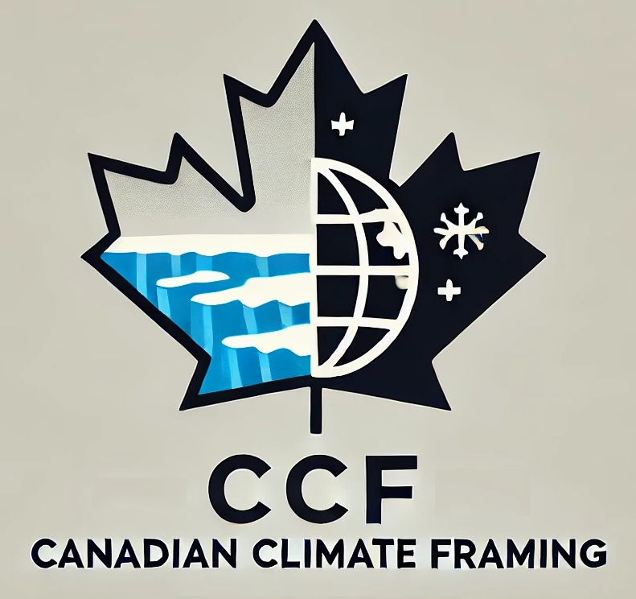
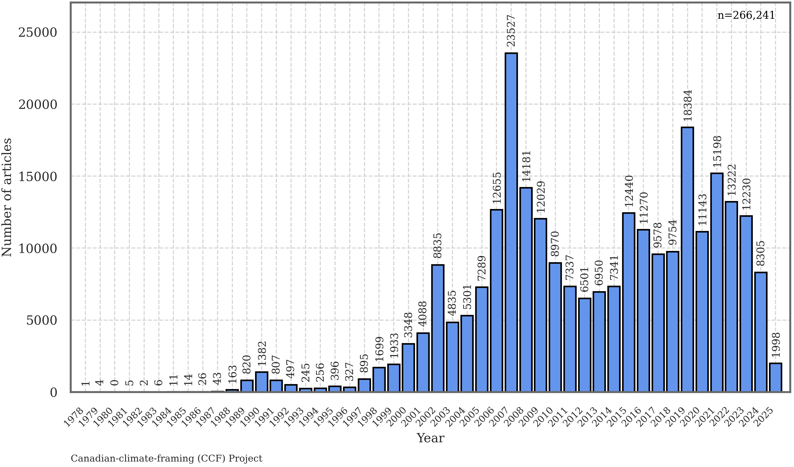
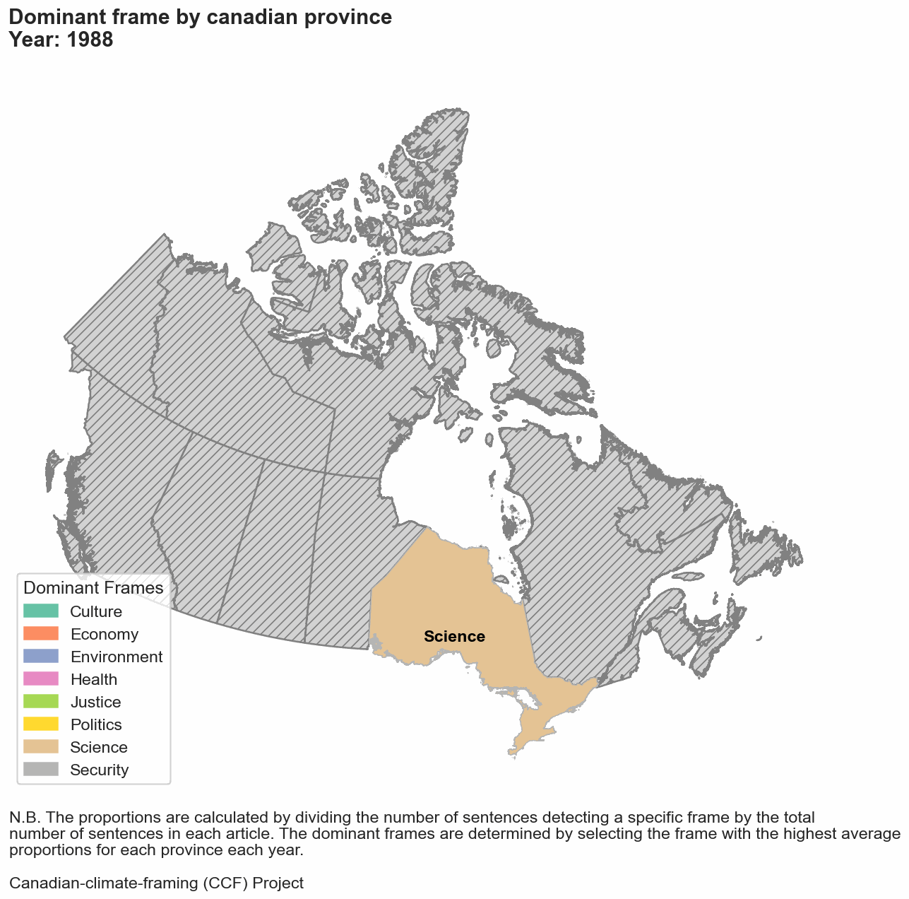

# CCF-canadian-climate-framing

<p align="center">
   
</p>

## Introduction

> Welcome to the **CCF-canadian-climate-framing** repository. This project is dedicated to studying media coverage of climate change in the Canadian press. It aims to understand how climate change narratives are constructed and communicated to the public using a database of over 250,000 articles and advanced machine learning techniques. This is the first initiative of this scale in Canada known to the authors.

This work focuses on identifying and extracting a multitude of information by annotating the full texts of articles at the sentence level in order to analyze their complete content in the most detailed way, over time and across different Canadian regions and media outlets. We annotate [more than 60 categories](#what-do-we-annotate-and-extract-from-texts-) and extract all named entities (persons, organizations, locations). This repository contains all the scripts, data processing tools, and machine learning models necessary for conducting this study.

### The database

This repository includes a newly compiled database of climate change articles from 20 major Canadian newspapers (n=266,271) (_not available in plain text at this time for copyright reasons_). The table below shows the distribution of articles per newspaper (_after filtering and preprocessing_), and the figure the distribution of articles through time.

| Toronto Star | Globe and Mail | Vancouver Sun | Edmonton Journal | Le Devoir | National Post | Calgary Herald | Whitehorse Daily Star | Montreal Gazette | Chronicle Herald | The Telegram | Times Colonist | La Presse Plus | La Presse | Winnipeg Free Press | Acadie Nouvelle | Star Phoenix | Le Droit | Toronto Sun | Journal de Montreal | **Total** |
|--------------|----------------|---------------|------------------|-----------|---------------|----------------|-----------------------|------------------|------------------|--------------|----------------|----------------|----------|----------------------|-----------------|--------------|----------|-------------|---------------------|-----------|
| 46980         | 29442           | 17871          | 18162             | 13685      | 20032          | 19336           | 7603                   | 9567              | 10770              | 5841          | 11800            | 9548            | 6917      | 12421                  | 5143             | 7794          | 4727      | 3174         | 5458                 | **266271** |



---

## Table of contents

- [Introduction](#introduction)
- [Members of the project](#members-of-the-project)
- [Project objectives](#project-objectives)
- [Methodology](#methodology)
- [What do we annotate and extract from texts?](#what-do-we-annotate-and-extract-from-texts-)
- [Illustrative Results and Analyses](#illustrative-results-and-analyses)
- [Citation](#citation)
- [Repository structure](#repository-structure)
- [Usage](#usage)
- [Scripts overview](#scripts-overview)
  - [Annotation scripts](#annotation-scripts)
    - [1_Preprocess.py](#1_preprocesspy)
    - [2_JSONL.py](#2_jsonlpy)
    - [3_Manual_annotations.py](#3_manual_annotationspy)
    - [4_JSONL_for_training.py](#4_jsonl_for_trainingpy)
    - [5_populate_SQL_database.py](#5_populate_sql_databasepy)
    - [6_Training_best_models.py](#6_training_best_modelspy)
    - [7_Annotation.py](#7_annotationpy)
    - [8_NER.py](#8_nerpy)
    - [9_JSONL_for_recheck.py](#9_jsonl_for_recheckpy)
    - [10_Annotation_metrics.py](#10_annotation_metricspy)

--- 

## Members of the project

- [**Alizée Pillod**, Université de Montréal](https://pol.umontreal.ca/repertoire-departement/professeurs/professeur/in/in35292/sg/Aliz%C3%A9e%20Pillod/), alizee.pillod@umontreal.ca 
- [**Antoine Lemor**, Université de Sherbrooke](https://antoinelemor.github.io/), antoine.lemor@usherbrooke.ca
- [**Matthew Taylor**, Université de Montréal](https://www.chairedemocratie.com/fr/members/taylor-matthew/), matthew.taylor@umontreal.ca


## The project's main idea and objectives

> **The overarching goal of the project is to establish the first pan-Canadian database—comprehensive across time and space—of media articles on climate change, and to perform an in-depth sentence-level analysis of each article’s content.**

The primary purpose is to understand the determinants of climate change media coverage in Canada, in order to inform future research and, ultimately, enhance communication on this topic.

To carry out this overarching research idea, the project is organized around the following objectives, which are currently underway:

| Objective | Description | Status |
|-----------|-------------|--------|
| **Establish a comprehensive pan-Canadian database of climate change media articles** | Establish a comprehensive and representative database covering the entire country's media landscape with historical coverage across both time and space. | **Completed** |
| **Deploy an advanced sentence-level annotation pipeline** | Deploy an annotation pipeline that combines the precision of manual annotations and the scale of machine learning along with named entity extraction to process and annotate articles at the sentence level. | **Completed** |
| **Implement a rigorous, scientifically robust validation process for machine learning models** | Conduct comprehensive performance evaluations using statistical analyses and manual annotations to verify high classification accuracy and ensure research-grade reliability. | *In Progress* |
| **Publish the database and initial analyses** | Release the processed database and preliminary research findings for public use. | *Upcoming* |

## Methodology

The research workflow for this project is structured as follows:

1.  **Data acquisition and initial corpus:** the foundational dataset comprises 266,271 articles related to climate change from 20 major Canadian newspapers, covering the period from 1978 to the present. *Due to copyright restrictions, the raw text of these articles is not publicly available in this repository.*

2.  **Preprocessing:** articles are processed using `Scripts/Annotation/1_Preprocess.py` to segment texts and generate analytical units (texts are segmented into two-sentence contexts), which are then used to annotate the articles. This step also involves data cleaning and format standardization.

3.  **Database population:** The processed textual data, along with article metadata, is organized and stored in a local PostgreSQL database named `CCF`. The script `Scripts/Annotation/5_populate_SQL_database.py` manages the creation of the database schema and populates key tables, including `CCF_full_data` (for raw article information) and `CCF_processed_data` (for tokenized and annotated sentences).

4.  **Annotation strategy & model training:**
    *   A manual annotation phase is conducted to create high-quality labeled datasets for more than 60 categories (see below - [What do we annotate and extract from texts?](#what-do-we-annotate-and-extract-from-texts-)) through scripts such as `Scripts/Annotation/2_JSONL.py` (to prepare data for annotation tools), `Scripts/Annotation/3_Manual_annotations.py` (to count and analyze manual annotations), and `Scripts/Annotation/4_JSONL_for_training.py` (to structure data for machine learning) are employed. While the specific annotated datasets are not public due to copyright restrictions, they form the basis for training our machine learning models.
    *   State-of-the-art transformer-based models (including CamemBERT and other BERT variants, managed via refactored libraries like `AugmentedSocialScientist` from [Do et al. (2022)](https://journals.sagepub.com/doi/full/10.1177/00491241221134526)) are trained. The script `Scripts/Annotation/6_Training_best_models.py` is used to train and select the optimal models based on performance metrics from cross-validation.

5.  **Automated corpus annotation:** Once trained and validated, these machine learning models are applied to the entire corpus of 266,271 articles. `Scripts/Annotation/7_Annotation.py` performs this large-scale annotation for more than 60 categories (see below - [What do we annotate and extract from texts?](#what-do-we-annotate-and-extract-from-texts-)).

6.  **Named Entity Recognition (NER):** To further enrich the dataset, Named Entity Recognition is performed using `Scripts/Annotation/8_NER.py`. This script identifies and categorizes mentions of persons (PER), organizations (ORG), and locations (LOC) within the text. This process utilizes a hybrid approach that combines best SOTA models: spaCy for French PER and transformer models like CamemBERT/BERT-base-NER for other entities and English.

7.  **Validation and Quality Control:** The integrity and quality of the annotations are paramount. `Scripts/Annotation/9_JSONL_for_recheck.py` facilitates the creation of targeted subsets of data for manual re-verification, especially for underrepresented or ambiguous categories. Performance metrics, including precision, recall, and F1-scores for each annotated category, are systematically computed using `Scripts/Annotation/10_Annotation_metrics.py` to ensure transparency and the best qualitify of the annotation process.

## What do we annotate and extract from texts ?


> **We annotate at the sentence level over 60 pieces of information and categories (frames, actors, emotions, etc.) :**


| Count (N) | Main category or frame                  | Sub-category            | What the sub-category captures                                                               |
| --------- | --------------------------------------- | ------------------------------- | -------------------------------------------------------------------------------------------- |
| **1**     | **Geographical Focus**                      | Canadian Context                | Situates climate change in Canada (places, actors, data, policies).                          |
| **2**     | **Events**                              | *Any Climate-Related Event*     | Mentions at least one of the following five event types.                      |
| **3**     |                                         | Natural Disaster Imminence      | Arrival or unfolding of floods, wildfires, hurricanes, heatwaves, etc.                       |
| **4**     |                                         | Climate Conference / Summit     | International meetings such as COP, UN summits, major national conferences.                  |
| **5**     |                                         | Report Release                  | Publication of governmental, NGO or scientific reports (e.g., IPCC, Lancet Countdown).       |
| **6**     |                                         | Election Campaign               | Climate issues raised during local, provincial or national elections.                        |
| **7**     |                                         | Policy Announcement             | Debut or unveiling of new climate laws, regulations or action plans.                         |
| **8**     | **Actors & Messengers** | *Any messenger quoted*             | Presence of any messenger, expert or authority figure.                                  |
| **9**     |                                         | Medical & Public-Health Experts | Physicians, epidemiologists, health ministers, public-health officials.                      |
| **10**    |                                         | Economic & Finance Experts      | Economists, finance ministers, market analysts, central-bank officials.                      |
| **11**    |                                         | Security & Defense Experts      | Military officers, defense strategists, security scholars.                                   |
| **12**    |                                         | Legal Experts                   | Lawyers, judges, legal scholars, justice ministers.                                          |
| **13**    |                                         | Cultural Figures                | Artists, writers, athletes, arts scholars commenting on climate change.                      |
| **14**    |                                         | Scientists (Natural or Social)  | Researchers or academics speaking in a scientific capacity.                                  |
| **15**    |                                         | Environmental Activists         | NGO spokespeople or well-known climate activists.                                            |
| **16**    |                                         | Political Actors                | Politicians, government officials, political scientists.                                     |
| **17**    | **Climate Solutions**                   | *Any Solution Mentioned*        | Mentions any mitigation or adaptation measure.                              |
| **18**    |                                         | Mitigation Strategies           | Measures to reduce GHG emissions or enhance carbon sinks.                                    |
| **19**    |                                         | Adaptation Strategies           | Measures to increase social or ecological resilience to climate impacts.                     |
| **20**    | **Health & Climate**                    | *Any Health Link*               | Mentions any relationship between climate and health.                       |
| **21**    |                                         | Negative Health Impacts         | Heat stress, disease spread, respiratory issues, mental-health burdens, mortality.           |
| **22**    |                                         | Positive Health Impacts         | Benefits such as fewer cold-related deaths.                                                  |
| **23**    |                                         | Health Co-benefits of Action    | Better air quality, improved diets, avoided premature deaths, mental well-being.             |
| **24**    |                                         | Health-Sector Footprint         | Emissions generated by hospitals, pharma supply chains, medical equipment.                   |
| **25**    | **Economy & Climate**                   | *Any Economic Link*             | Mentions any economic dimension of climate change.                          |
| **26**    |                                         | Negative Economic Impacts       | Crop losses, tourism decline, productivity drops, rising insurance costs.                    |
| **27**    |                                         | Positive Economic Impacts       | New growing zones, Arctic shipping routes, renewable-energy jobs.                            |
| **28**    |                                         | Costs of Climate Action         | Debt burdens, competitiveness concerns, job displacement, budget trade-offs.                 |
| **29**    |                                         | Benefits of Climate Action      | Economic growth, innovation leadership, job creation, cost savings.                          |
| **30**    |                                         | Economic Sector Footprint       | Emissions from industry, transport, energy; accounting or reduction targets.                 |
| **31**    | **Security & Climate**                  | *Any Security Link*             | Mentions any security dimension.                                   |
| **32**    |                                         | Military Disaster Response      | Army called in for fires, floods, evacuations or relief.                                     |
| **33**    |                                         | Military Base Disruption        | Climate impacts on bases or military infrastructure readiness.                               |
| **34**    |                                         | Climate-Driven Displacement     | Military management of evacuations or refugee camps.                                         |
| **35**    |                                         | Resource Conflict               | Tensions or violence over water, land or minerals worsened by climate change.                |
| **36**    |                                         | Defense-Sector Footprint        | Emissions and energy use of armed forces and defense contractors.                            |
| **37**    | **Justice & Climate**                   | *Any Justice Link*              | Mentions any social-justice angle.                                          |
| **38**    |                                         | Winners & Losers                | Groups that benefit or suffer from climate measures (workers, vulnerable populations, etc.). |
| **39**    |                                         | North–South Responsibility      | Common-but-differentiated responsibilities between high-income and low-income countries.     |
| **40**    |                                         | Legitimacy of Responses         | Public trust, fairness, acceptability of climate policies.                                   |
| **41**    |                                         | Climate Litigation              | Court cases or legal challenges over climate responsibility.                                 |
| **42**    | **Culture & Climate**                   | *Any Culture Link*              | Mentions any cultural aspect.                                               |
| **43**    |                                         | Artistic Representation         | Books, documentaries, plays, exhibitions portraying climate themes.                          |
| **44**    |                                         | Event Disruption                | Sports or cultural events threatened or cancelled due to climate conditions.                 |
| **45**    |                                         | Loss of Indigenous Practices    | Erosion of traditional hunting, fishing, or cultural rituals linked to climate.              |
| **46**    |                                         | Cultural-Sector Footprint       | Emissions from film production, fashion, large festivals, etc.                               |
| **47**    | **Environment & Climate**           | *Any Biodiversity Link*         | Mentions any biodiversity concern.                                          |
| **48**    |                                         | Habitat Loss                    | Glacier melt, coral bleaching, forest die-off, wetland drying.                               |
| **49**    |                                         | Species Loss                    | Local or global extinction risk for animals or plants.                                       |
| **50**    | **Science & Climate**                 | *Any Science Link*              | Mentions any scientific aspect.                                             |
| **51**    |                                         | Scientific Controversy          | Debates on climate change reality, causes, thresholds, geo-engineering ethics.               |
| **52**    |                                         | Discovery & Innovation          | New findings on climate impacts or emerging technologies (e.g., carbon capture).             |
| **53**    | **Politics & Policy Process**           | *Any Policy / Political Debate* | Mentions any policy measure or political discussion.                        |
| **54**    |                                         | Policy Measures                 | Concrete climate laws, regulations, or programmes under debate or in force.                  |
| **55**    |                                         | Political Debate & Opinion      | Parliamentary disputes, party platforms, public-opinion polls on climate.                    |
| **56**    | **Extreme-Weather Mentions**            | Weather Hazards                 | Any specific storm, heatwave, flood, wildfire, drought, ice-melt referenced.                 |
| **57**    | **Framing – Gains vs Losses**           | Gains Frame                     | Narratives emphasising economic or societal gains.                                           |
| **58**    |                                         | Loss Frame                      | Narratives emphasising economic or societal costs or damages.                                |
| **59**    |                                         | Balanced Frame                  | Coverage giving roughly equal weight to gains and losses.                                    |
| **60**    | **Emotional Tone**                      | *Emotion Classification*        | Detects presence and valence of emotion.                                        |
| **61**    |                                         | Positive Emotion                | Hope, optimism, pride, inspiration.                                                          |
| **62**    |                                         | Negative Emotion                | Fear, anger, sadness, anxiety, loss.                                                         |
| **63**    |                                         | Neutral / No Emotion            | Factual or analytical coverage with no clear emotional tone.                                 |
|    | **Named Entities**                      | *Entity Extraction*             | Detection of people, organisations and locations mentioned in the text.         |
| **64**    |                                         | Person Mentions                 | Named individuals (PER).                                                                     |
| **65**    |                                         | Organization Mentions           | Institutions, corporations, agencies (ORG).                                                  |
| **66**    |                                         | Location Mentions               | Geographic places such as cities, provinces, countries (LOC).                                |

## Illustrative Results and Analyses

Below is an illustrative example of the analyses conducted in this project. The animated GIF shows how the **dominant climate-change frame** evolves from year to year across Canadian provinces. For each article, the proportion of sentences mentioning a given frame is calculated; the frame with the highest average proportion in each province for each year is designated as the **dominant frame**. Gray-hatched provinces indicate insufficient data for that year.



---

## Citation

If you use this repository, the data, or the methodology in your research, please cite:

Lemor, A., Pillod, A. & Taylor, M. (2025). CCF-Canadian-Climate-Framing: A Repository for Analyzing Climate Change Narratives in Canadian Media. [Software/Data Repository]. GitHub. https://github.com/antoinelemor/CCF-canadian-climate-framing 


---

## Repository structure

```
CCF-Canadian-Climate-Framing/
├── Database/
│   ├── Database/
│   │   ├── CCF.media_database.csv _absent from the repository due to copyright restrictions_
│   │   ├── CCF.media_processed_texts.csv _absent from the repository due to copyright restrictions_
│   │   ├── CCF.media_processed_texts_annotated.csv _absent from the repository due to copyright restrictions_
│   │   ├── Canadian_Media_Articles_by_Province.csv
│   │   ├── Canadian_Media_by_Group.csv
│   │   ├── Database_media_count.csv
│   │   ├── articles_per_year.png
│   │   └── dominant_frames_yearly.gif
│   └── Training_data/
│       ├── manual_annotations_JSONL/ _excluded until our first publication_
│       │   ├── Annotated_sentences.jsonl _excluded_
│       │   ├── label_config.json _excluded_
│       │   ├── sentences_to_annotate_EN.jsonl _excluded_
│       │   ├── sentences_to_annotate_FR.jsonl _excluded_
│       │   ├── sentences_to_recheck_multiling.jsonl _excluded_
│       │   └── sentences_to_recheck_multiling_done.jsonl _excluded_
│       ├── annotation_bases/ _excluded until our first publication_
│       ├── training_database_metrics.csv
│       ├── models_metrics_summary_advanced.csv
│       ├── non_trained_models.csv
│       ├── manual_annotations_metrics.csv
│       ├── annotated_label_metrics.csv
│       └── final_annotation_metrics.csv
├── Scripts/
│   └── Annotation/
│       ├── 1_Preprocess.py
│       ├── 2_JSONL.py
│       ├── 3_Manual_annotations.py
│       ├── 4_JSONL_for_training.py
│       ├── 5_Populate_SQL_database.py
│       ├── 6_Training_best_models.py
│       ├── 7_Annotation.py
│       ├── 8_NER.py
│       ├── 9_JSONL_for_recheck.py
│       └── 10_Annotation_metrics.py
└── Models/ _contents are excluded due to file size and ongoing research_
└── requirements.txt

README.md
```

## Usage

The project is organized into several scripts, each responsible for different aspects of data processing, annotation, and model training. Below is an overview of how to use them.

### Annotation scripts

1. **Preprocess data**
   ```bash
   python Scripts/Annotation/1_Preprocess.py
   ```
2. **Generate JSONL files**
   ```bash
   python Scripts/Annotation/2_JSONL.py
   ```
3. **Manual annotations**
   ```bash
   python Scripts/Annotation/3_Manual_annotations.py
   ```
4. **Prepare JSONL for training**
   ```bash
   python Scripts/Annotation/4_JSONL_for_training.py
   ```
5. **Populate SQL database**
   ```bash
   python Scripts/Annotation/5_populate_SQL_database.py
   ```
6. **Training best models**
   ```bash
   python Scripts/Annotation/6_Training_best_models.py
   ```
7. **Annotation process**
   ```bash
   python Scripts/Annotation/7_Annotation.py
   ```
8. **NER (Named Entity Recognition)**
   ```bash
   python Scripts/Annotation/8_NER.py
   ```
9. **Generate JSONL for rechecking**
   ```bash
   python Scripts/Annotation/9_JSONL_for_recheck.py
   ```
10. **Final annotation metrics**
    ```bash
    python Scripts/Annotation/10_Annotation_metrics.py
    ```


## Scripts overview

### Annotation scripts

#### 1_Preprocess.py

**Purpose:**
Preprocesses the media database CSV by generating sentence contexts and verifying date formats.

Key features:
Splits texts into two-sentence contexts. Counts words and updates relevant columns. Saves processed data to a new CSV.

Dependencies:
`os`, `pandas`, `spacy`

#### 2_JSONL.py

**Purpose:**
Converts processed text data into JSONL files for manual annotation, separating French and English sentences.

Key features:
Loads and cleans CSV data. Removes duplicates. Splits data by language. Creates JSONL with metadata fields.

Dependencies:
`os`, `pandas`, `json`

#### 3_Manual_annotations.py

**Purpose:**
Reads manual annotations from a JSONL file, counts label usage, and exports annotation metrics.

Key features:
Calculates label usage distribution. Outputs CSV with label proportions.

Dependencies:
`json`, `csv`, `os`

#### 4_JSONL_for_training.py

**Purpose:**
Prepares manually annotated JSONL data for training/validation splits.

Key features:
Splits data into train/validation sets. Handles stratification for main/sub labels. Exports annotation metrics to a CSV.

Dependencies:
`json`, `os`, `random`, `csv`

#### 5_populate_SQL_database.py

**Purpose:**
Create the local PostgreSQL database CCF and populate it
with two tables drawn from the project’s CSV files (CCF_full_data and  CCF_processed_data) containing all the extracted articles.

*Due to copyright restrictions, the code that were used to extract the articles are not published*

#### 6_Training_best_models.py

**Purpose:**
Trains selected best models using advanced metrics from cross-validation.

Key features:
Loads best epoch from `models_metrics_summary_advanced.csv`. Summarizes fully trained/partial/not trained status. Logs results and error handling.

Dependencies:
`os`, `sys`, `glob`, `shutil`, `json`, `pandas`, `torch`, `AugmentedSocialScientist`

#### 7_Annotation.py

**Purpose:**
Applies trained English and French models to annotate the main database, saving or resuming progress as needed.

Key features:
Loads/updates existing annotation columns. Performs annotation for detection, sub-categories, etc. Logs and saves partial results to handle interruptions.

Dependencies:
`torch`, `tqdm`, `pandas`, `numpy`

#### 8_NER.py

**Purpose:**
This script performs large-scale Named Entity Recognition (PER, ORG, LOC) on the sentence-level data stored in the PostgreSQL table CCF_processed_data.


Key features:
Language-aware NER pipelines in French (spaCy for PER + CamemBERT for ORG/LOC) and English (BERT-base-NER for PER/ORG/LOC).

Dependencies:
`psycopg2`, `pandas`, `torch`, `tqdm`, `joblib`, `spacy`, `transformers`
