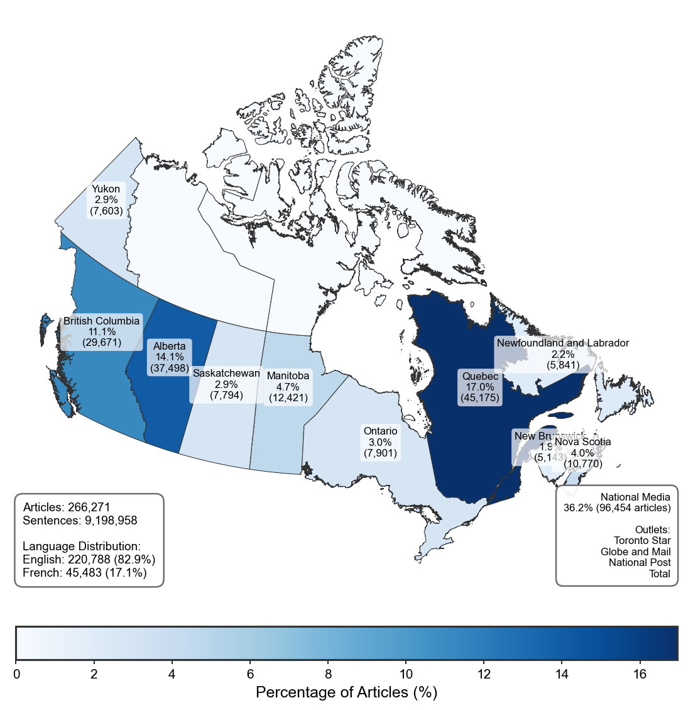

# CCF-canadian-climate-framing

<p align="center">
   
</p>

# [Have a look at our website here!](https://ccf-project.ca/Home)

## Technical paper

### **[Read the full technical paper here](https://github.com/antoinelemor/CCF-canadian-climate-framing/blob/main/paper/CCF_Methodology/Latex/CCF_Methodology.pdf)**

[](https://github.com/antoinelemor/CCF-canadian-climate-framing/blob/main/paper/CCF_Methodology/Latex/CCF_Methodology.pdf)
[](https://github.com/antoinelemor/CCF-canadian-climate-framing/blob/main/paper/CCF_Methodology/Latex/CCF_Methodology_SI.pdf)
[](paper/CCF_Methodology/Latex/CCF_Methodology.pdf)
[](https://dataverse.harvard.edu/dataverse/CCF)
[](paper/CCF_Methodology/Latex/CCF_Methodology.pdf)

The technical paper, currently under revision at *Scientific Data* (Nature Portfolio), documents:
- **Complete annotation framework** with 65 hierarchical categories
- **Machine-learning pipeline** with model selection, training, reinforced training, and validation
- **Performance metrics** for all categories (macro F1 = 0.866 on the gold standard)
- **Enriched PostgreSQL database** with six relational tables, including a `pgvector` table of BAAI/bge-m3 sentence embeddings (1024-dim)
- **Reliability tier classification** (A / B / C) for every category, based on F1 and inter-coder agreement
- **Full reproducibility pipeline** from preprocessing to deposited tables

## Introduction

Welcome to the **CCF-canadian-climate-framing** repository. This project is dedicated to studying media coverage of climate change in the Canadian press through the most comprehensive machine-learning-preprocessed corpus of climate discourse available for research. The **[CCF Database](https://github.com/antoinelemor/CCF-canadian-climate-framing/blob/main/paper/CCF_Methodology/Latex/CCF_Methodology.pdf)** comprises 266,271 articles from 20 Canadian newspapers (1978–2024) processed into 9,198,958 sentence-level analytical units with 65 hierarchical annotations, achieving a macro F1 score of 0.866 across all categories. This is the first initiative of this scale in Canada known to the authors.

This work focuses on identifying and extracting a multitude of information by annotating the full texts of articles at the sentence level in order to analyze their complete content in the most detailed way, over time and across different Canadian regions and media outlets. We annotate [more than 60 categories](#what-do-we-annotate-and-extract-from-texts-) including eight thematic frames (economic, health, security, justice, political, scientific, environmental, cultural), actor networks, climate events, policy responses, emotional tone, and geographic focus. The deposited database is implemented in PostgreSQL and combines six relational tables — two sentence-level tables (`CCF_full_data`, `CCF_processed_data`), two article-level rollups (`CCF_article_aggregates` for the 65 per-article proportions, `CCF_article_entities` for the named-entity rollup), a per-category reliability lookup (`CCF_reliability_tiers`), and a `pgvector` table of BAAI/bge-m3 sentence embeddings (`CCF_sentence_embeddings`, 9.46 million 1024-dimensional vectors with HNSW cosine indexing) — so researchers can write either fine-grained sentence-level queries, fast article-level aggregations, or semantic-similarity searches without rewriting the same joins on every project.

This repository contains the annotation pipeline, the reporting pipeline, the training-data CSVs, the manuscript sources, and the figure / table outputs that accompany the paper. The deposited database itself is hosted on Harvard Dataverse (see [Citation](#citation)).

### The database

This repository documents a newly compiled database of climate change articles from 20 major Canadian newspapers (n = 266,271) covering the period 1978–2024. Due to copyright restrictions on newspaper content, the raw sentence text is not redistributed here; the deposited database contains the article-level metadata (title, author, publication date, newspaper, page number), the sentence-level identifiers, the 65 binary annotations per sentence, the named-entity extractions, the article-level aggregates, the reliability tiers, and the BGE-M3 embeddings. Any researcher with institutional access to Factiva, Eureka.cc, or ProQuest Canadian Newsstream can recover the original text from the bibliographic coordinates we provide.

The deposit is hosted on **[Harvard Dataverse](https://dataverse.harvard.edu/dataverse/CCF)** (DOI to be added at publication time) as both a PostgreSQL dump and a set of language-agnostic CSV exports, under a CC-BY 4.0 licence. The table below shows the distribution of articles per newspaper (after filtering and preprocessing), and the figure shows the geographic distribution of articles across Canada.

| Toronto Star | Globe and Mail | National Post | Calgary Herald | Edmonton Journal | Vancouver Sun | Le Devoir | Winnipeg Free Press | Times Colonist | Chronicle Herald | Montreal Gazette | La Presse Plus | Star Phoenix | Whitehorse Daily Star | La Presse | The Telegram | Journal de Montreal | Acadie Nouvelle | Le Droit | Toronto Sun | **Total** |
|--------------|----------------|---------------|----------------|------------------|---------------|-----------|---------------------|----------------|------------------|------------------|----------------|--------------|----------------------|-----------|--------------|---------------------|-----------------|----------|-------------|-----------|
| 46,980 | 29,442 | 20,032 | 19,336 | 18,162 | 17,871 | 13,685 | 12,421 | 11,800 | 10,770 | 9,567 | 9,548 | 7,794 | 7,603 | 6,917 | 5,841 | 5,458 | 5,143 | 4,727 | 3,174 | **266,271** |



---

## Table of contents

- [Introduction](#introduction)
- [Members of the project](#members-of-the-project)
- [Project objectives](#project-objectives)
- [Methodology](#methodology)
- [What do we annotate and extract from texts?](#what-do-we-annotate-and-extract-from-texts-)
- [Citation](#citation)
- [Repository structure](#repository-structure)
- [Usage](#usage)
- [Scripts overview](#scripts-overview)
  - [Annotation pipeline (01–14)](#annotation-pipeline)
  - [Reporting pipeline (15–17)](#reporting-pipeline)
  - [Paper figure scripts](#paper-figure-scripts)

---

## Members of the project

- [**Alizée Pillod**, Université de Montréal](https://pol.umontreal.ca/repertoire-departement/professeurs/professeur/in/in35292/sg/Aliz%C3%A9e%20Pillod/), alizee.pillod@umontreal.ca
- [**Antoine Lemor**, Université de Sherbrooke](https://antoinelemor.github.io/), antoine.lemor@usherbrooke.ca
- [**Matthew Taylor**, Université de Montréal](https://www.chairedemocratie.com/fr/members/taylor-matthew/), matthew.taylor@umontreal.ca

## The project's main idea and objectives

> **The overarching goal of the project is to establish the first pan-Canadian database—comprehensive across time and space—of media articles on climate change, and to perform an in-depth sentence-level analysis of each article's content.**

The primary purpose is to understand the determinants of climate change media coverage in Canada, in order to inform future research and, ultimately, enhance communication on this topic.

To carry out this overarching research idea, the project is organized around the following objectives, which are currently underway:

| Objective | Description | Status |
|-----------|-------------|--------|
| **Establish a comprehensive pan-Canadian database of climate change media articles** | Establish a comprehensive and representative database covering the entire country's media landscape with historical coverage across both time and space. | **Completed** |
| **Deploy an advanced sentence-level annotation pipeline** | Deploy an annotation pipeline that combines the precision of manual annotations and the scale of machine learning along with named entity extraction to process and annotate articles at the sentence level. | **Completed** |
| **Implement a rigorous, scientifically robust validation process for machine learning models** | Conduct comprehensive performance evaluations using statistical analyses and manual annotations to verify high classification accuracy and ensure research-grade reliability. | **Completed** |
| **Publish the database and initial analyses** | Release the processed database and preliminary research findings for public use. | *In Progress* |

## Methodology

The research workflow is organised in five phases, each backed by deterministic and idempotent scripts. The full pipeline runs end-to-end on a single Apple Mac Studio (M2 Ultra, 128 GB unified memory); the sentence-embedding ingestion at step 09 is the dominant cost.

1. **Data acquisition and initial corpus.** The foundational dataset comprises 266,271 climate-related articles from 20 major Canadian newspapers covering the period 1978–2024. The articles were retrieved through institutional subscriptions to Factiva, Eureka.cc, and ProQuest Canadian Newsstream using a small set of bilingual Boolean keywords (`"climate change"`, `"global warming"`, `"climate crisis"`, ..., and their French equivalents). *Raw article text is not redistributed here due to copyright restrictions.*

2. **Preprocessing.** `Scripts/Annotation/01_Preprocess.py` segments each article into two-sentence sliding-window units using language-specific spaCy models (`en_core_web_lg` for English, `fr_dep_news_trf` for French), and `Scripts/Annotation/02_JSONL.py` writes the JSONL needed for manual annotation. Duplicate articles are removed with a 95 % fuzzy-similarity threshold, articles shorter than 100 words are discarded, and fastText verifies language assignment.

3. **Database population.** `Scripts/Annotation/05_populate_SQL_database.py` builds the initial PostgreSQL database with two tables: `CCF_full_data` (article-level metadata for the 266,271 documents) and `CCF_processed_data` (9,198,958 two-sentence units with all annotation columns).

4. **Annotation training and corpus annotation.** A single expert annotator labelled 4,000 sentences (1,927 English + 2,073 French) covering all 65 categories using `Scripts/Annotation/03_Manual_annotations.py` and `Scripts/Annotation/04_JSONL_for_training.py`. `Scripts/Annotation/06_Training_best_models.py` trains 128 BERT-base / CamemBERT-base classifiers (one per category × language) through the [Augmented Social Scientist](https://journals.sagepub.com/doi/full/10.1177/00491241221134526) framework, with an automated reinforced training phase triggered when the positive-class F1 falls below 0.60 during normal training (45 of 128 models triggered the reinforcement). `Scripts/Annotation/07_Annotation.py` applies the trained models to the entire corpus, and `Scripts/Annotation/08_NER.py` adds Named Entity Recognition (PER / ORG / LOC) using a hybrid pipeline (BERT-base-NER for English, spaCy `fr_core_news_lg` + CamemBERT-NER for French). `Scripts/Annotation/09_create_sentence_embeddings.py` then ingests the BAAI/bge-m3 sentence embeddings into the `CCF_sentence_embeddings` table (`halfvec(1024)` via `pgvector`) and provisions an HNSW cosine index over the 9,462,845 vectors.

5. **Validation and quality control.** `Scripts/Annotation/10_JSONL_for_recheck.py` builds a 1,000-sentence stratified validation set with root-inverse probability weighting, `Scripts/Annotation/11_Annotation_metrics.py` benchmarks the model output against the gold standard, `Scripts/Annotation/12_Blind_verification.py` strips labels for a blind second-coder pass, `Scripts/Annotation/13_Intercoder_reliability.py` computes Cohen's κ, Krippendorff's α, and Gwet's AC1 per category and overall, and `Scripts/Annotation/14_create_intercoder_progression_plot.py` produces the intercoder-progression figure.

6. **Reporting.** Scripts 15, 16, and 17 normalise the canonical CSVs and generate every reproducible table of the manuscript and Supplementary Information: Tables 3 and 4 plus the inter-coder block for the main, and Supplementary Tables S4--S12 for the SI. The manuscript LaTeX sources (`CCF_Methodology.tex` and `CCF_Methodology_SI.tex`) live in `paper/CCF_Methodology/Latex/` and `\input{}` the generated tables directly; both documents are edited by hand.

## What do we annotate and extract from texts ?

> **We annotate at the sentence level 65 categories organized hierarchically (frames, actors, events, solutions, emotions, etc.). See Supplementary Table S3 in the [methodology paper](paper/CCF_Methodology/Latex/CCF_Methodology_SI.pdf) for complete definitions.**

| # | Category | Code | Description |
|---|----------|------|-------------|
| | **THEMATIC FRAMES** | | |
| | *Economic Frame* | | |
| 1 | Economic Frame (Primary) | `economic_frame` | Climate change framed as an economic issue |
| 2 | Negative impacts on economy | `eco_neg_impact` | Economic losses from climate change |
| 3 | Positive impacts on economy | `eco_pos_impact` | Economic gains from climate change |
| 4 | Economic costs of action | `eco_cost` | Financial burdens of climate policies |
| 5 | Economic benefits of action | `eco_benefit` | Financial gains from climate policies |
| 6 | Economic sector footprint | `eco_footprint` | Carbon footprint of economic/industrial sectors |
| | *Health Frame* | | |
| 7 | Health Frame (Primary) | `health_frame` | Climate change framed as a health issue |
| 8 | Negative health impacts | `health_neg_impact` | Health harms from climate change |
| 9 | Health co-benefits of action | `health_cobenefit` | Health benefits from climate policies |
| | *Security Frame* | | |
| 10 | Security Frame (Primary) | `security_frame` | Climate change framed as a security issue |
| 11 | Climate refugees | `security_refugees` | Displacement due to climate impacts |
| 12 | Resource conflict | `security_conflict` | Conflicts over resources due to climate |
| 13 | Post-disaster military assistance | `security_military` | Military deployment after disasters |
| 14 | Disruption of military operations | `security_disruption` | Climate impacts on military infrastructure |
| | *Justice Frame* | | |
| 15 | Justice Frame (Primary) | `justice_frame` | Climate change framed as a justice/moral issue |
| 16 | Winners and losers | `justice_winners` | Distributional outcomes of climate policy |
| 17 | Differentiated responsibility | `justice_responsibility` | Unequal responsibility for causing climate change |
| 18 | Unequal vulnerability | `justice_vulnerability` | Unequal exposure to climate impacts |
| 19 | Unequal access to action | `justice_access` | Unequal capacity to act on climate |
| 20 | Intergenerational justice | `justice_intergen` | Rights of future generations |
| | *Political Frame* | | |
| 21 | Political Frame (Primary) | `political_frame` | Climate change framed as a political issue |
| 22 | Policy action | `pol_action` | Adoption of climate policies |
| 23 | Political debate | `pol_debate` | Disagreements on climate policies |
| 24 | Political positioning | `pol_position` | Stances of politicians/parties on climate |
| 25 | Public opinion data | `pol_opinion` | Polls/surveys on climate attitudes |
| | *Scientific Frame* | | |
| 26 | Scientific Frame (Primary) | `scientific_frame` | Climate change framed as a scientific issue |
| 27 | Scientific debate | `sci_debate` | Debates within the scientific community |
| 28 | Scientific discovery | `sci_discovery` | Explanations or discoveries in climate science |
| 29 | Questioning of climate science | `sci_skepticism` | Challenges to validity of climate science |
| 30 | Defense of climate science | `sci_defense` | Affirmations of climate science validity |
| | *Environmental Frame* | | |
| 31 | Environmental Frame (Primary) | `environmental_frame` | Climate change framed as an environmental issue |
| 32 | Loss of natural environments | `env_habitat` | Degradation/loss of habitats |
| 33 | Loss of fauna and flora | `env_species` | Impacts on animal and plant species |
| | *Cultural Frame* | | |
| 34 | Cultural Frame (Primary) | `cultural_frame` | Climate change framed as a cultural issue |
| 35 | Artistic representation | `cult_art` | Cultural depictions of climate change |
| 36 | Event disruption | `cult_event_impact` | Climate impacts on cultural/sports events |
| 37 | Loss of Indigenous practices | `cult_indigenous` | Erosion of Indigenous cultural practices |
| 38 | Cultural sector footprint | `cult_footprint` | Carbon footprint of cultural/sports sectors |
| | **PRIMARY CATEGORIES** | | |
| | *Actors/Messengers* | | |
| 39 | Messenger (Primary) | `messenger` | Presence of quoted sources or experts |
| 40 | Health expert | `msg_health` | Medical or public health expertise |
| 41 | Economic expert | `msg_economic` | Economic or financial expertise |
| 42 | Security expert | `msg_security` | Security or defense expertise |
| 43 | Legal expert | `msg_legal` | Legal expertise |
| 44 | Cultural/Sport expert | `msg_cultural` | Cultural, artistic, or sports expertise |
| 45 | Natural scientist | `msg_scientist` | Natural/hard science expertise |
| 46 | Social scientist | `msg_social` | Social science expertise |
| 47 | Activist | `msg_activist` | Advocacy or activism |
| 48 | Public official | `msg_official` | Politicians or government representatives |
| | *Events* | | |
| 49 | Event (Primary) | `event` | Presence of climate-related events |
| 50 | Extreme weather event | `evt_weather` | Storms, floods, wildfires, heatwaves, etc. |
| 51 | Meeting/Conference | `evt_meeting` | Summits, conferences, official visits |
| 52 | Publication | `evt_publication` | Release of reports, studies, articles |
| 53 | Election | `evt_election` | Electoral campaigns or votes |
| 54 | Policy announcement | `evt_policy` | Unveiling of new policies or plans |
| 55 | Judiciary decision | `evt_judiciary` | Court rulings or legal proceedings |
| 56 | Cultural/Sports event | `evt_cultural` | Organization of cultural or sports events |
| 57 | Protest | `evt_protest` | Demonstrations or protests |
| | *Solutions* | | |
| 58 | Solution (Primary) | `solution` | Presence of climate solutions |
| 59 | Mitigation strategy | `sol_mitigation` | Measures to reduce GHG emissions |
| 60 | Adaptation strategy | `sol_adaptation` | Measures to cope with climate impacts |
| | **EMOTIONAL TONE** | | |
| 61 | Positive emotion | `tone_positive` | Optimistic, hopeful, reassuring tone |
| 62 | Negative emotion | `tone_negative` | Alarming, critical, pessimistic tone |
| 63 | Neutral emotion | `tone_neutral` | Informative, balanced, factual tone |
| | **GEOGRAPHIC FOCUS** | | |
| 64 | Canadian context | `canada` | References to Canada |
| | **URGENCY** | | |
| 65 | Urgency to act | `urgency` | Sense of urgency or alarmism |
| | **NAMED ENTITIES** | | |
| — | Named Entity Recognition | `ner_entities` | Extraction of PER, ORG, LOC entities (JSON) |

---

## Citation

If you use the data, the methodology, or the accompanying software in your research, please cite both the deposited dataset and the methodology paper:

**Data citation** (Harvard Dataverse, DOI to be added at publication time):

> Lemor, A., Pillod, A., & Taylor, M. (2026). *Canadian Climate Framing (CCF) Database: A sentence-level corpus of 266,271 climate-change articles from 20 Canadian newspapers (1978–2024)* [Data set]. Harvard Dataverse. https://doi.org/10.7910/DVN/XXXXXX

**Methodology paper** (Scientific Data, under revision):

> Lemor, A., Pillod, A., & Taylor, M. (2026). The Canadian Climate Framing (CCF) database: a sentence-level annotated corpus for the analysis of climate-change discourse in the Canadian press. *Scientific Data* (under revision).

A BibTeX entry consistent with these references is available in [`paper/CCF_Methodology/Latex/references.bib`](paper/CCF_Methodology/Latex/references.bib) (key `lemor_ccf_database_2026`).

---

## Repository structure

```
CCF-canadian-climate-framing/
├── Database/
│   └── Training_data/                                     (training-time CSVs and gold standard)
│       ├── all_best_models.csv                            + _normalized.csv
│       ├── training_database_metrics.csv                  + _normalized.csv
│       ├── manual_annotations_metrics.csv                 + _normalized.csv
│       ├── final_annotation_metrics.csv                   + _normalized.csv
│       ├── non_trained_models.csv
│       ├── per_category_reliability_normalized.csv        (per-category κ / α / AC1 / F1)
│       ├── reliability_tiers.csv                          (tier A / B / C lookup)
│       ├── training_hyperparameters_normalized.csv        (per-model hyperparameters)
│       ├── training_static_configuration.csv              (pipeline-wide constants)
│       ├── Training_logs/                                 (per-model training and reinforced-training metrics CSVs)
│       └── manual_annotations_JSONL/
│           ├── intercoder_reliability_1_overall_summary.csv
│           ├── intercoder_reliability_2_per_label_reliability.csv
│           ├── intercoder_reliability_3_learning_progression.csv
│           ├── intercoder_reliability_4_before_after_600.csv
│           ├── intercoder_reliability_4_model_performance.csv
│           ├── intercoder_reliability.csv
│           ├── label_mapping_second_coder.csv
│           └── label_mapping_second_coder_canonical.csv
├── Scripts/
│   └── Annotation/                                        (17 zero-padded scripts, executed in order)
│       ├── 01_Preprocess.py                               ── segment into two-sentence units
│       ├── 02_JSONL.py                                    ── build JSONL for manual annotation
│       ├── 03_Manual_annotations.py                       ── aggregate manual annotations
│       ├── 04_JSONL_for_training.py                       ── train / validation split
│       ├── 05_populate_SQL_database.py                    ── initial PostgreSQL DB (CCF_full_data, CCF_processed_data)
│       ├── 06_Training_best_models.py                     ── 128 BERT / CamemBERT classifiers (incl. reinforced phase)
│       ├── 07_Annotation.py                               ── apply models to the entire corpus
│       ├── 08_NER.py                                      ── PER / ORG / LOC on every sentence
│       ├── 09_create_sentence_embeddings.py               ── CCF_sentence_embeddings (BAAI/bge-m3 halfvec(1024) + HNSW)
│       ├── 10_JSONL_for_recheck.py                        ── stratified validation sample
│       ├── 11_Annotation_metrics.py                       ── precision / recall / F1 vs. gold
│       ├── 12_Blind_verification.py                       ── strip labels for the blind second-coder pass
│       ├── 13_Intercoder_reliability.py                   ── Cohen's κ, Krippendorff's α, Gwet's AC1
│       ├── 14_create_intercoder_progression_plot.py       ── intercoder-progression figure
│       ├── 15_normalize_categories.py                     ── canonical category API + normalised metrics CSVs
│       ├── 16_build_normalized_csvs.py                    ── per-category reliability, tiers, hyperparameters CSVs
│       └── 17_generate_tables.py                          ── reproducible LaTeX tables (main + SI)
├── paper/
│   └── CCF_Methodology/
│       ├── Latex/
│       │   ├── CCF_Methodology.tex                        (main manuscript; \input{}s the generated tables)
│       │   ├── CCF_Methodology.pdf
│       │   ├── CCF_Methodology_SI.tex                     (Supplementary Information; \input{}s the SI tables)
│       │   ├── CCF_Methodology_SI.pdf
│       │   ├── references.bib
│       │   ├── Figures/                                   (figures referenced from the manuscript)
│       │   └── submission_package/                        (frozen initial submission, kept for reproducibility)
│       ├── Review/
│       │   ├── reviewers.txt                              (reviewers' comments)
│       │   ├── editor.txt                                 (editor decision letter)
│       │   └── response/                                  (point-by-point response, .tex + .pdf)
│       └── Results/
│           ├── Scripts/                                   (figure-generation scripts for the paper)
│           │   ├── 1_overview_plots.py                    ── distribution by media outlet, year, province
│           │   ├── 2_temporal_f1_validation.py            ── temporal F1 evolution plot
│           │   ├── 3_data_overview.py                     ── Data Overview heatmap + descriptive tables
│           │   └── generate_latex_tables.py               ── framework-definition LaTeX tables
│           └── Outputs/
│               ├── Figures/                               (PNG/PDF figures used in the paper)
│               ├── Tables/                                (LaTeX tables \input{}ed by the manuscript and SI)
│               └── Stats/                                 (CSV statistics referenced from the paper)
├── requirements.txt
├── CCF_icone.jpeg
└── README.md
```

**Conventions.** Scripts in `Scripts/Annotation/` are zero-padded so a lexicographic sort matches the execution order: 01--14 form the annotation pipeline (including the BGE-M3 sentence-embedding ingestion at step 09), and 15--17 form the reporting pipeline (CSV normalisation, revision artefacts, table generators).

## Usage

The pipeline runs end-to-end on a single Apple Mac Studio (M2 Ultra, 128 GB unified memory); only the sentence-embedding ingestion at step 09 requires substantial wall-clock time (≈ 19 GB of float16 vectors, ≈ 2 h for the COPY plus 20–40 min for the HNSW build).

### Annotation pipeline

```bash
python Scripts/Annotation/01_Preprocess.py                       # segment into two-sentence units
python Scripts/Annotation/02_JSONL.py                            # build JSONL for manual annotation
python Scripts/Annotation/03_Manual_annotations.py               # aggregate manual annotations
python Scripts/Annotation/04_JSONL_for_training.py               # train / validation split
python Scripts/Annotation/05_populate_SQL_database.py            # initial PostgreSQL DB
python Scripts/Annotation/06_Training_best_models.py             # 128 BERT / CamemBERT classifiers (incl. reinforced phase)
python Scripts/Annotation/07_Annotation.py                       # apply models to the entire corpus
python Scripts/Annotation/08_NER.py                              # PER / ORG / LOC on every sentence
python Scripts/Annotation/09_create_sentence_embeddings.py       # CCF_sentence_embeddings (BAAI/bge-m3, halfvec(1024) + HNSW)
python Scripts/Annotation/10_JSONL_for_recheck.py                # stratified validation sample
python Scripts/Annotation/11_Annotation_metrics.py               # precision / recall / F1 vs. gold standard
python Scripts/Annotation/12_Blind_verification.py               # strip labels for the blind second-coder pass
python Scripts/Annotation/13_Intercoder_reliability.py           # κ / α / AC1 per category and overall
python Scripts/Annotation/14_create_intercoder_progression_plot.py
```

### Reporting pipeline

```bash
# Canonical category API + normalised training-time CSVs
python Scripts/Annotation/15_normalize_categories.py

# Per-category reliability, tier assignment, and training-hyperparameter CSVs
python Scripts/Annotation/16_build_normalized_csvs.py

# Reproducible LaTeX tables (main manuscript + Supplementary Information)
python Scripts/Annotation/17_generate_tables.py

# The manuscript and SI LaTeX sources \input{} these tables directly.
```

### Manuscript compilation

```bash
cd paper/CCF_Methodology/Latex
pdflatex CCF_Methodology    && biber CCF_Methodology    && pdflatex CCF_Methodology    && pdflatex CCF_Methodology
pdflatex CCF_Methodology_SI && biber CCF_Methodology_SI && pdflatex CCF_Methodology_SI && pdflatex CCF_Methodology_SI
```

## Scripts overview

### Annotation pipeline

#### 01_Preprocess.py
Segments each article into two-sentence sliding-window units using language-specific spaCy models (`en_core_web_lg` for English, `fr_dep_news_trf` for French), counts words, verifies date formats, and writes the processed CSV consumed by subsequent steps.

Dependencies: `pandas`, `spacy`.

#### 02_JSONL.py
Converts the preprocessed CSV into JSONL files for manual annotation, separating French and English sentences and stripping near-duplicates.

Dependencies: `pandas`, `json`.

#### 03_Manual_annotations.py
Reads the manually annotated JSONL, counts label usage, and exports an annotation-metrics CSV.

Dependencies: `json`, `csv`.

#### 04_JSONL_for_training.py
Prepares the manually annotated JSONL data for training: splits into train / validation sets, handles stratification for main and sub-labels, and exports annotation metrics to CSV.

Dependencies: `json`, `random`, `csv`.

#### 05_populate_SQL_database.py
Creates the local PostgreSQL database `CCF_Database` and populates it with the two original tables `CCF_full_data` (article-level metadata) and `CCF_processed_data` (two-sentence units with annotation columns).

*Due to copyright restrictions, the article-extraction code is not published.*

Dependencies: `psycopg2`, `pandas`.

#### 06_Training_best_models.py
Trains 128 BERT-base / CamemBERT-base classifiers (one per category × language) through the Augmented Social Scientist framework. The automated reinforced-training phase is triggered when the positive-class F1 falls below 0.60 during normal training; 45 of 128 models triggered the reinforcement.

Dependencies: `torch`, `pandas`, `AugmentedSocialScientist`.

#### 07_Annotation.py
Applies the trained English and French models to the entire `CCF_processed_data` table, with resumable progress, language-aware batching, and partial-result logging.

Dependencies: `torch`, `tqdm`, `pandas`, `numpy`, `psycopg2`.

#### 08_NER.py
Large-scale Named Entity Recognition (PER, ORG, LOC) on the sentence-level data. French uses spaCy (`fr_core_news_lg`) for PER and CamemBERT-NER for ORG / LOC; English uses BERT-base-NER for all three types.

Dependencies: `psycopg2`, `pandas`, `torch`, `tqdm`, `spacy`, `transformers`.

#### 09_create_sentence_embeddings.py
Ingests the BAAI/bge-m3 sentence embeddings (1024-dimensional, L2-normalised, float16) into the PostgreSQL table `CCF_sentence_embeddings` as a `pgvector` `halfvec(1024)` column, covering every sentence in `CCF_processed_data` plus every article title (stored under `sentence_id = 0`). An HNSW index on the cosine operator class is provisioned afterwards so semantic-similarity queries return in milliseconds. Execution is resumable: ingestion is skipped when the row count already matches.

Dependencies: `psycopg2`, `numpy`, `pickle`; requires `pgvector` ≥ 0.7 with `CREATE EXTENSION vector` enabled in `CCF_Database`.

#### 10_JSONL_for_recheck.py
Builds a multilingual JSONL file directly from `CCF_processed_data` for the post-deployment validation, using root-inverse weighted sampling with hard constraints to guarantee balanced representation across rare and common labels while preserving language distribution and excluding sentences seen during training.

Dependencies: `pandas`, `psycopg2`, `tqdm`.

#### 11_Annotation_metrics.py
Benchmarks the model-generated annotations against the gold-standard JSONL. Outputs a wide-format CSV with precision, recall, and F1 for each label, both classes (positive / negative), each language (EN / FR), and the combined corpus (ALL), plus micro, macro, and weighted averages.

Dependencies: `pandas`, `psycopg2`, `tqdm`.

#### 12_Blind_verification.py
Creates a blind-verification copy of a manual-annotation JSONL by wiping all labels, so the second coder can re-label without bias. Streaming I/O, robust error handling, CLI arguments with sensible defaults.

Dependencies: `argparse`, `json`, `tqdm`.

#### 13_Intercoder_reliability.py
Computes Cohen's κ, Krippendorff's α, Gwet's AC1, and percent agreement between annotation rounds. Exports detailed CSV reports with confidence intervals.

Dependencies: `pandas`, `krippendorff`, `sklearn`.

#### 14_create_intercoder_progression_plot.py
Publication-ready plot of Krippendorff's α progression across the annotation campaign, used in the methodology paper.

Dependencies: `pandas`, `matplotlib`, `seaborn`.

---

### Reporting pipeline

#### 15_normalize_categories.py
Defines the canonical category API used by every downstream script (`ALL_CATEGORIES`, `PRIMARY_CATEGORIES`, `normalize_category`, `escape_latex`, `format_code`, `get_section_headers`), normalises all training-time CSVs, and produces the legacy B-tables that map onto Supplementary Tables S4 / S5 / S7 / S8.

Dependencies: `pandas`, `psycopg2`.

#### 16_build_normalized_csvs.py
Single script for the normalised reliability artefacts under `Database/Training_data/`, orchestrated in three top-level builders:
- `build_per_category_reliability()` → `per_category_reliability_normalized.csv`: full-sample, training-phase and blind-phase Cohen's κ, Krippendorff's α, Gwet's AC1, percent agreement, and F1 agreement for every category.
- `build_reliability_tiers()` → `reliability_tiers.csv`: tier A / B / C assignment per language and overall, including the prevalence-induced reliability deflation flag and exclusion flags.
- `build_training_hyperparameters()` → `training_hyperparameters_normalized.csv` and `training_static_configuration.csv`: per-model best epoch, training phase, validation losses, per-class metrics, plus pipeline-wide static constants and campaign timings.

The script reuses the canonical category API from `15_normalize_categories.py` and writes byte-deterministic CSVs consumed by `17_generate_tables.py`.

Dependencies: `pandas`, `importlib`.

#### 17_generate_tables.py
Single script for every reproducible numerical / structural table of the manuscript and Supplementary Information:
- Main manuscript: Table 3 (training-set performance for primary detection categories), Table 4 (validation F1 macro / micro / weighted by language), the inline intercoder block for the blind-phase trio.
- Supplementary Information: S4 (complete training metrics), S5 (train / val distribution), S7 (detailed validation metrics on the gold standard), S8 (database-wide distribution, pulled live from PostgreSQL), S9 (per-category κ / α / AC1), S10 (reliability-tier assignment), S11 (per-model training hyperparameters), S12 (data dictionary of the enriched database).

Deterministic regeneration from the canonical CSVs, three-decimal formatting, automatic LaTeX escaping, reuse of the canonical category API from `15_normalize_categories.py`, and direct write to `paper/CCF_Methodology/Results/Outputs/Tables/`.

Dependencies: `pandas`, `psycopg2`, `importlib`.

---

### Paper figure scripts

The `paper/CCF_Methodology/Results/Scripts/` directory contains the scripts that generate the figures and the descriptive tables of the methodology paper. The directory is intentionally minimal: the manuscript is a data-descriptor, so the only scripts kept here are the ones that document what the deposited database contains.

#### 1_overview_plots.py
Overview figures: distribution of articles by media outlet, total articles per year, and choropleth map of articles by province. Reads `CCF_full_data` and writes to `Results/Outputs/Figures/`.

#### 2_temporal_f1_validation.py
Temporal F1 evolution plot showing model-performance stability across five consecutive time periods.

#### 3_data_overview.py
Data Overview artefacts (Section *Data Overview* of the manuscript): a heatmap of the mean per-article share of each thematic frame from 1990 to 2024, plus two LaTeX tables (article-level descriptive statistics; top-10 named entities by type). Reads `CCF_article_aggregates`, `CCF_article_entities`, and `CCF_full_data` directly from PostgreSQL.

#### generate_latex_tables.py
Generates the LaTeX framework-definition tables used in the paper.
